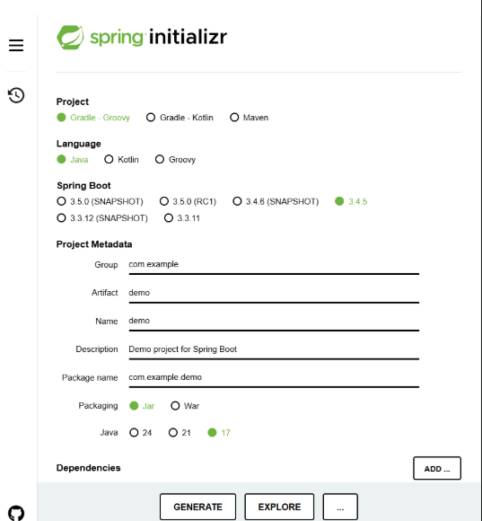
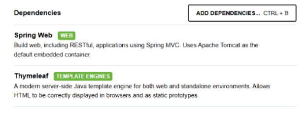
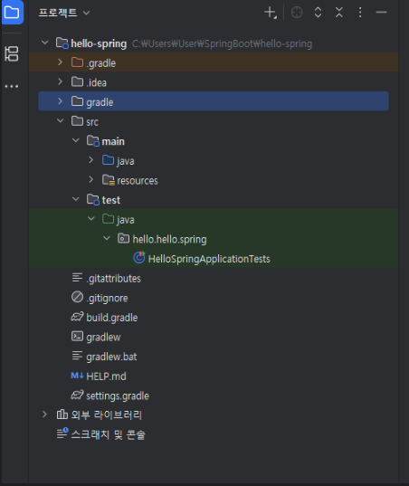
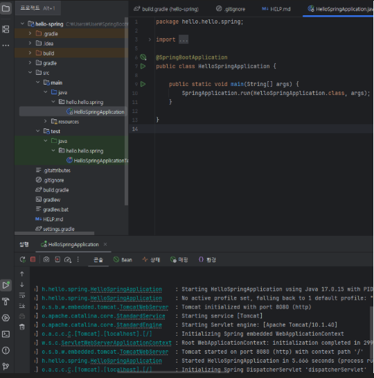
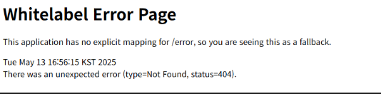
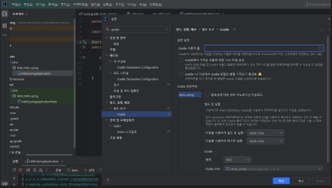
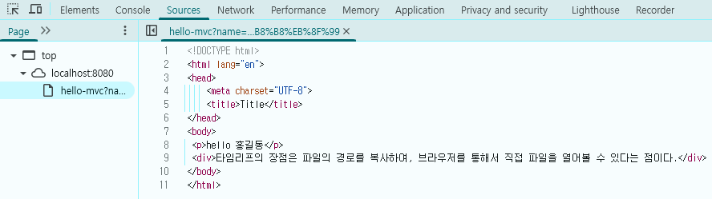
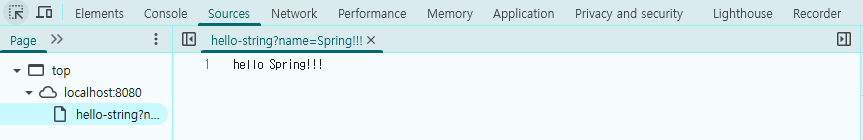
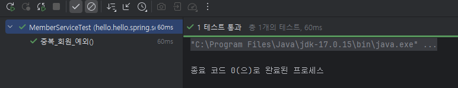
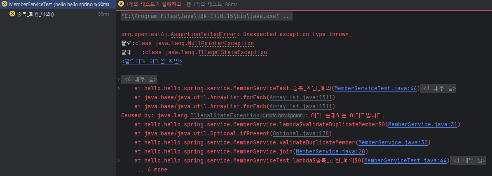

<h1> 목차</h1>

1. Intelli J 설치하기 
2. intelli J를 통한 테스트 방법
3. 정리 

<hr>

<h2> 1. Intelli J 설치하기</h2>

아래의 링크를 통해 확인이 가능함 <br/> 
https://www.jetbrains.com/ko-kr/idea/download/?section=windows <br/>

<br/>
설치에 대한 자세한 내용 <br/>
https://proefforter.tistory.com/26 <br/>

<br/>

<h2>2. Intelli J와 함께 사용할 스프링 부트 </h2>
start.spring.io 링크에 들어가면 메인 화면이 나온다. 


<br/>
[그림 1] start.spring.io의 메인 화면
<br/>
해당 화면에서 SNAPSHOP은 현재 만들고 있는 버전이라고 생각하면 되고, ()가 붙여저 있지 않은 상태의 버전을 클릭하면 된다 

<h2>2-1 의존성 설정</h2> <br/>
Spring에서는 "의존성"이 존재한다. <br/>

의존성을 추가하기 위해서는 **그림1의 Dependencies의 ADD...를 눌러 의존성을 추가**하면 된다. <br/>

 <br/>
[그림 2 ] 웹 사이트를 위해 의존성을 추가한 모습 <br/>
위의 그림2를 통해서 의존성을 추가한 것을 볼 수 있다. <br/>

다음으로 그림1의 GENERATE를 눌러 본인이 원하는 위치에 파일을 생성할 수 있다. <br/>

 <br/>

<h2>3. Intelli J에서 generate한 파일 불러오기 </h2>
Intellil J를 설치한 뒤 그림2에서 생성한 프로젝트를 불러와야한다. 

Intelli J를 통해서 파일을 불러올 때 해당 파일의 build.gradle을 선택해서 가져온 뒤  open as project를 클릭해서 불러올 수 있다. 

 <br/>

<h2>4. propject의 구조 </h2>

 <br/>

[그림 3] 프로젝트의 구조 <br/>
main과 test라는 폴더가 나누어진 것을 볼 수 있다.  <br/>

**main : 내부에 실제 페키지랑 소스파일이 있는 것을 볼 수 있다.  <br/>**

**test : test코드들과 관련된 소스코드가 들어가 있다고 볼 수 있다.  <br/>**

respurces: xml 등 설정 파일이 들어가 있다고 볼 수 있다. 즉, 자바 파일을 제외한 나머지는 다 들어가 있다고 볼 수 있다.  <br/>


<br/>

<h2>5. 해당 파일의 main 함수를 통해 실행하기 </h2>

 <br/>

[그림 4 ] src 내부의 HelloSpringAppicationdml 소스코드 <br/><br/>

그림 4 내부의 main함수의 삼각형을 클릭해서 실행하면, 실행되는 것을 볼 수 있다. <br/>
**그림 4의 Tomcat initialized with port 8080 (http)를 보고 웹 브라우저의 localhost:8080을 친다면 아래 그림 5와 같은 화면을 볼 수 있다.**

 <br/>

 <br/>

[그림 5] localhost:8080의 내용  <br/>
위의 그림 5와 같이 나온다면 성공한 내용이다.  <br/>
위의 내용은 SpringBoot에서 아무것도 작성하지 않은 상태에서 실행하면 나오는 화면이기에, 서버가 잘 작동하는 것을 알 수 있다. <br/>

 <br/>

<h2>6. properties 설정 </h2>

 <br/>

[그림 6] intelli J의 properties 화면 <br/>
 
그림 6의  빌드 및 실행 , 테스트 실행을 기존의 gradle에서 intelli J로 설정한다면 속도가 보다 빠르게 실행될 수 있다. <br/>


<hr>

<h2>@ResponseBody의 유무의 차이</h2>

1. ResponseBody가 존재하지 않는경우
<br/> 

```
    @GetMapping("hello-mvc")
    public String helloMVC(@RequestParam(name = "name", required = false) String name, Model model){
        // 윈도우의 경우 ctrl + P를 통해서 함수나, 메서드의 파라미터 정보를 확인할 수 있다.
        // required = false -> 해당하는 파라미터가 없어도 오류가 발생하지 않는다.
        // required = true -> 해당하는 파라미터가 반드시 포함되어야 하며, 파라미터가 포함되지 않고 전달될 경우에, 404 Bad Request가 나온다.
        model.addAttribute("name",name);
        
        return "hello_template"; // viewResolver가 templates의 hello-template.html을 찾아서 반환을 해줌
    }
```
<br/>

 <br/>
[그림 7] controller에서 ResponseBody를 포함하지 않는 경우 <br/>

<br/>
<hr>

2. ResponseBody가 존재하는 경우 <br/>

```
    @GetMapping("hello-string")
    @ResponseBody // http의 head부와 body부 중에서 body부에 직접 넣어주겠다는 의미
    public String helloString(@RequestParam("name") String name){
        // ResponseBody로 인해서 viewResolver를 거치지 않고 간다.
        return "hello " + name; // hello + 파라미터
    }

```
<br/>

 <br/>
[그림 8] controller에서 ResponseBody를 포함하여 viewResolver를 거치지 않고 데이터를 전송한 모습 


<h2> 2.intelli J를 통한 테스트 방법 </h2>

(1) service의 이름이 중복되면 안된다는 로직 

```
private void validateDuplicateMember(Member member) {
        Optional<Member> result =  memberRepository.findByName(member.getName());
        // ifPresent 값이 null이 아닌 값이 존재한다면 아래의 로직이 작동
        // Optional이기 때문에 가능함
        result.ifPresent(m-> {
            throw new IllegalStateException("이미 존재하는 아이디입니다.");
        });
    }
```

(2) 해당 로직에 대한 테스트 케이스 코드 내용 

```
 public  void 중복_회원_예외(){
        // given
        Member member1 = new Member();
        member1.setName("Spring");
        
        Member member2 = new Member();
        member2.setName("Spring");
        // when
        memberService.join(member1); // 회원 1을 회원가입 시켰다고 가정
        assertThrows(IllegalStateException.class, () -> memberService.join(member2));
```

**아래의 그림9와 그림 10을 통해서 테스트가 정상적으로 통과된 모습과 통과되지 못했을 때 모습을 볼 수 있다.**
 
 <br/>
[그림 9] 테스트가 정상적으로 통과된 모습 

<br/><br/>


[그림 10] 테스트가 정상적으로 통과되지 못햇을 때 

**그림 10은 IllegalStateException이 아닌 NullPointException을 적용하자 에러가 발생한 것을 볼 수 있다.**


<hr> 
<h2> 3.정리</h2>

1. 정적 컨텐츠  <br/>
파일을 있는 그대로 내려서 보여준다. <br/>
<br/>

3. MVC <br/> 
mvc와 템플릿 엔진을 model, view, controller로 쪼개서 view를 템플릿 엔진을 활용하여 조금 더 프로그래밍하여 랜더링 후 클라이언트에게 전달해준다. <br/>
<br/>

3. API 
API는 보통의 Spring 개발에서 API 방식은 객체를 반환하는 JSON 스타일로 변환하여 반환시키는 것 (View를 사용하지 않는 것)

```
@GetMapping("hello-api")
@ResponseBody // JSON으로 반환하는게 훨씬 편하며, ViewResorver가 아닌 HttpMessageConverter가 작동한다.
public Hello helloApi(@RequestParam("name") String name){
    Hello hello = new Hello();
    hello.setName(name);
    return hello;
}

// 정적클래스 Hello 생성
static class Hello {
    private  String name;

    public String getName(){
    return name;
    }
    
    public void setName(String name){
    this.name = name;
    }

}
```
4. Optional이란? <br/>
oOptional은 null이 올 수 있는 값을 감싸는 wrapper 클래스이다. <br/>
Optional을 사용한다면 NPE(Null Point Exception)이 발생하지 않도록 도와준다. <br/>
   <br/><br/>
* ifPresent() :  Void 타입이며, ifPresent()는 Optional 객체가 값을 가지고 있으면 실행하며, <br/>
값이 없으면 넘어감
 
<br/>
<br/>
* isPresent() : Boolean 타입이며, Optional 객체가 값을 가지고 있다면 true, 값이 없다면 false 리턴한다.

<br/>

```

Optional이란? 
Optional<T>는 null이 올 수 있는 값을 감싸는 Wrapper 클래스로, 참조하더라도 NPE
(Null Point Exception)가 발생하지 않도록 도와준다. 

    memberRepository.findById(member.getId())는  Optional<Member> 타입이기 때문에, 위의 코드를 축약해서
        아래처럼 나태낼 수 있다.
    memberRepository.findById(member.getId())
                    .ifPresent(m ->{
                        throw new IllegalStateException("이미 존재하는 아이디입니다.");
                    });
         
```